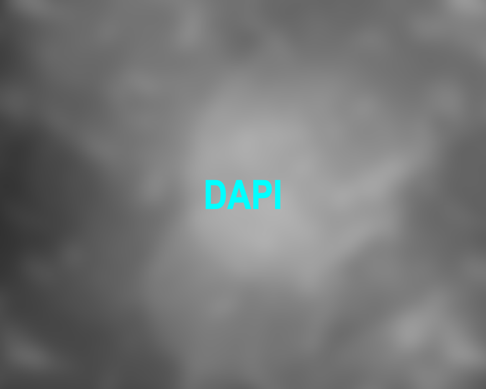
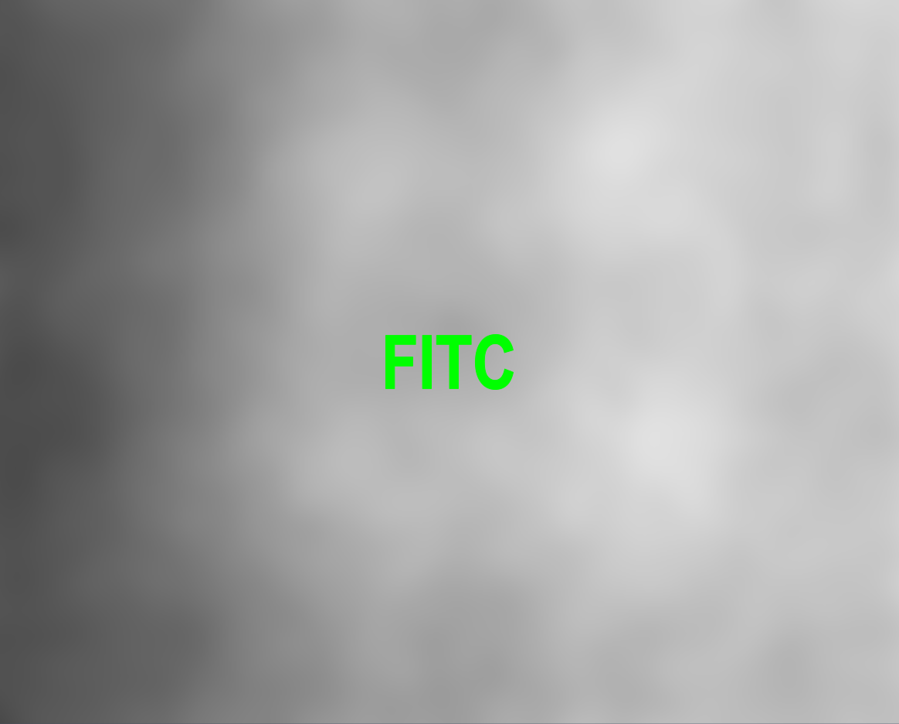

+++
date = '2026-01-16T10:08:20'
draft = false
layout = "simple"
title = 'Whole Slide Shading Reference Creation'
+++
## Overview
Image artifacts result from the non-uniformity of illumination/excitation across an objective's field of view. This can happen with both brightfield and fluorescence images. These artifacts are generally seen at image edges, due to the nature of the excitation sources and objective lenses. Although they may not be apparent in a single field of view, these aberrations are especially noticeable on tiled images, especially whole slide images, where many hundreds of individual images are stitched together to create montages of entire tissue sections, at the millimeter or centimeter length scale. See both broghtfield and fluorescence examples below.
 
 
This is an image of a kidney stained with H&E (left) and an image of just a blank part of the slide (right):

 
 


## The Goal
The goal in whle slide imaging is to remove the shading to end up with an image like this:


## How To:
Because the shading varies according to the lens and lighting conditions, it's usually best to use the image that you want to correct to generate a shading reference. We're going to use two different programs (Methods) in Zen to correct the image. First we'll use the "Shading Reference from tile Image" to generate a shading reference for each channel from the image we wish to correct. Then, in a second step, we'll use the "Shading Correction" method to apply the shading references we created in the previous step to the image, creating a beautifully corrected image that we can use for further analysis/processing.

> [!IMPORTANT]  Prerequisites
> <ol>
> <li>You have created a fluorescence image. A good reference image requires 300 or more  total tiles.</li>
> <li>Avoid <strong><i>any</i></strong> over- or underexposure in the image.</li>
> <li>Collect as many photons as possible. Use at least 35% of the camera's dynamic range.</li>
> <li>Acquisition must be done <i>without</i> activated Shading correction.</li>
> </ol>

> [!NOTE]
> Shading Correction is automatically applied to Brightfield images. No need to use the following procedure!

### Step by Step --- For Fluorescence Images

#### Step 1 Shading Reference From Tile Image



As stated above, and even though it sounds counterintuitive, you want to ensure that the "Scan" step of your scan profile does not have the boxes ticked for Shading Correction in the "Channels" area. That is, you must start with an image that has not been corrected during acquisition.



<ol>
    <li>Open Zen.</li>
    <li>Open the image you want to correct.</li>
    <li>Select the "Processing" tab.</li>
    <li>Select the "Shading Reference from Tile Image" Method.</li>
    <li>Three subsections appear - Parameters, Input, & Output.</li>
</ol>






<ul>
    <li>In the <strong>Input</strong> section, select the image you want to use to create the shading reference using the big white triangle.</li>
    <li>In the <strong>Output</strong> section, make sure that there are as many outputs as there are channels in the input image and that the radio button for "<strong>Create New Output</strong>" is selected for each new image to be created.</li>
</ul>






<ul>
    <li>In the <strong>Paramters</strong> section, set the tickboxes according to the image on the right:
    <li>If your image has multiple scenes, you will see an "All Scenes" tickbox. Tick the box to include tiles from all the scenes during the creation of the shading reference. The more tiles the better, so you should tick this if you have multiple scenes. </li>
    <li>Because you ticked the "All Scenes" tickbox, the "Selected Scenes" Slider will be grayed out.</li>
    <li>Leave the "Adjust per Channel" tickbox unticked. We want to create shading references specific for each channel, but the parameters we use for each channel are the same, so no need to tick this box.</li>
    <li>Do <strong>NOT</strong> tick the "Save directly as Shading Reference" tickbox. The shading references you are creating will only be useful for this image - no need to save for the future. You can always regenerate the shading reference following this guide using your original data.</li>
    <li>Tick the "Channel-specific" tickbox. This will create a separate shading reference for each channel. This is what you want.</li>
    <li>Tick the "Autoadjust Intensity" Tickbox to normalize the values in the shading reference.</li>
    <li>Leave the "Multiply Factor" slider at 1.0</li>
    <li>Tick the "Apply Gaussian Filter" tickbox and set the "Sigma" slider to a value of ~50.</li>
</ul>

 
 
 




Click on the "Apply" button outlined in red on the image below. You'll see a new image tab created for each channel in your original image. While the references are being created, the warning triangle will be present in the tab of the original image data and the new shading references, indicating that these images are locked for processing. Zen will automatically assign names to the new images. For a 3-Channel image with 3 scenes and a total of 775 tiles/channel, the shading reference creation took 5 minutes 30 seconds.




#### Step 2 Shading Correction



Each of the reference images represents an "average" tile from that channel. Filtering the input tiles with a Gaussian filter &#963=50 has the affect of blurring the details and leaving only the dark and light areas that are common to all tiles. See below for examples of the three shading references created from this image:
 

Now we will use each of these to correct its respective channel. Unfortunately, the Shading Correction Method only works on a single channel at a time. The following set of instructions is an example of how to use the shading correction method on a 3-Channel image three times in a row, creating three single channel corrrected images, and then using another method - Add Channels - to fuse these three individual channel images back into a single image of three channels. 


Once the shading references are created and the shading reference from tile image method has completed, it's time to use the shading references to correct the original image.

 1. Select Shading Correction as the method in the Processing tab Methods pane.
 1. Select the original image as the input image in the Input pane.
 1. Select the DAPI channel's shading referrence image as the Shading Reference image in the Input Pane.





In the Parameters Panes, set the choices as follows:

 - Select "Camera Shading" in the dropdown menu for "Shading Mode".
 - Leave the "Automatic" tickbox unselected. If you select it, ZEN will create the shading references as part of the correction and it will get them wrong. Your corrected image will look worse than your original image.
 - Select the "Adjust per Channel" tickbox. This will allow you to select different fates for each channel.
    - Select "Process Channel" for the DAPI Channel, select "Skip Channel" for the other two channels.
 - Leave the "Display Mode" and "offset" as the defaults - Multiplicative and 0, respectively.




Pressing "Apply" will now apply these settings and use the shading reference for the DAPI channel to correct the DAPI channel of the original image. A new image will be created with one DAPI channel and the image is corrected. Inspect this image to make sure the visible tiling lines have been removed.


Repeat this process for as many channels as you have. In this case, I had to repeat this twice - once for the FITC channel and once for the Rhodamine channel. Before pressing the apply button, change the shading refernce in the input section to the shading reference that matches the channel you are processing and change the channel you are processing in the Adjust per channel dropdown menu of the parameters pane. see the image below for an example of how I changed the settings to process the FITC channel.



After correcting all your channels you will likely have the following images open:
 1. The original image that you want to be corrected
 1. A shading reference for each channel in your original data.
 1. A corrected image for each channel in your original data.

 In my case this results in 7 image tabs open. Of these, the only one that is currently saved to the hard drive is the original data. At this point you can close the shading reference images, they are no longer needed. You can also close the original data as that will not be needed for the next step. Only the single channel, corrected images are required for the final step.



#### Step 3 Fuse the corrected channels to recreate a single multi-channel image.



You can only select two images as inputs for the add channels method at a time. Consequently, in the example below, to create a 3-channel corrected image, you will run the "Add Channels" method twice. First adding the fist and second corrected image channels to create a 2-channel corrected image. Then in a second round, you will add the third channel corrected image to the 2-channel image you created in the fist step. For 4-channels, it's a 3-step process- Add 1+2, add 3+4, then add the results of steps 1 and 2 to get the final 4-channel image.
 
 
First Channel Add:

 1. In the Method pane under the processing tab, select "Add Channels".
 1. Nothing to select in the "Method Parameters".
 1. Select the corrected images corresponding to the first two channels of your original image in the "Image Parameters".
 1. Click the "Apply" button to fuse the two channels into a single, 2-channel image.

 



Second Channel Add:

 1. In the Method pane under the processing tab, "Add Channels" should already be selected from the previous step.
 1. Nothing to select in the "Method Parameters".
 1. Select the corrected images corresponding to the reult of the last channel addition and the third channel in the "Image Parameters".
 1. Click the "Apply" button to fuse the images into a single, 3-channel, corrected image.

 



Save your final recreated image that should be identical to the original image, sans shading. You can close all the intermediate images without saving - if you need one of the channels or scenes from your original image that has been corrected you can use either the "Create Imge Subset" or the "Create Image Subset and Split" method in the Processing tab to generate the required files.



All the images created during this tutorial, from top to bottom in the list:
 
- Original, uncorrected image.

   

- DAPI shading reference image.

   

- FITC shading reference image.

   

- Rhodamine shading reference image.

   

- DAPI corrected image.

   

- FITC corrected image.

   

- Rhodamine corrected image.

   

- DAPI+FITC fused channel image.

   

- final result. A 3-channel corrected image.



