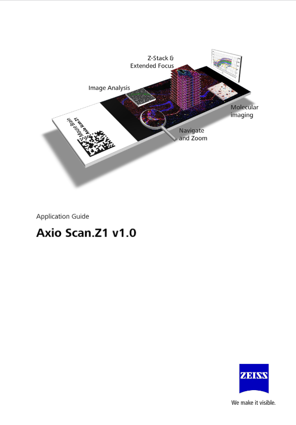

+++
date = '2025-08-29T09:39:42+01:00'
draft = false
title = 'AxioscanZ1'
layout = 'simple'
showHero = true
heroStyle = 'background'
+++

  
 Overview

## Overview
The AxioScan.Z1 is designed to scan the entire tissue on a slide. Our system is equipped to scan in brightfield or fluorescence modes. The system has an in built magazine to hold 100 3" X 1" slides. Once configured, the system is able to perform automated scanning by performing a pre-scan, identifying the tissue on the slide, creating a focus map, and then performing a scan using the selected instructions including magnifiation, mode, channels, exposure time and data saving location. 

Fluorescence Specifications:
- 7 LED light source [Zeiss Colibri](EN_product-info_Colibri-7_rel1-0.pdf) for fluorescence excitation:
    - wavelengths: 385nm, 430nm, 475nm, 511nm, 555nm, 590nm, 630nm
- Fluorescence Filter Cubes:
    - [Fs38 (GFP)](https://www.micro-shop.zeiss.com/en/uk/shop/filterAssistant/filtersets/489038-9901-000)
    - [Fs43 (DsRed)](https://www.micro-shop.zeiss.com/en/uk/shop/filterAssistant/filtersets/489043-9901-000)
    - [Fs50 (Cy5)](https://www.micro-shop.zeiss.com/en/uk/shop/filterAssistant/filtersets/488050-9901-000)
    - [Fs96 (DAPI)](https://www.micro-shop.zeiss.com/en/uk/shop/filterAssistant/filtersets/489096-9100-000)
- Lenses:
    - 2.5X/0.05, Fluar 5X/0.25, Plan-Apochromat 10x/0.45, Plan-Apochromat 20x/0.8, Plan-Apochromat 40X/0.95 Corr
- Cameras:
    - Zeiss [AxioCam506 mono](EN_product-info_Axiocam-506_mono.pdf)

  
 SOP

## SOP
Wholeslide scanning requires a different mindset than *normal* fluorescence imaging. When imaging at a confocal, the user has complete control over the parameters to acquire an image and can instantly change these, using information in the acquired data to update the acquisitionparameters. Whole slide imaging, in contrast, is completely automated. The goal is to offload the entire decision making process to the system. Users should be able to load the slides, select a file (Zeiss calls this a scan profile) that contains all the instructions to complete a scan, perform a preview scan, and then press the **scan** button. The system will then scan all the slides, freeing the user to perform other tasks.

To accomplish this, the system needs to know basic things about the imaging, like:
1. What type of contrast method you wish to use
2. Objective Lens
3. The exposure time
4. What to call the file
5. Where to store the file


Additionally and specifically for slide scanning, the system needs to know:

6. Which part of the slide contains your sample and which part of the sample you wish to scan.
7. How to focus the sample.



 
 
 
Pdf to understand concepts in whole slide scanning    --->





In the Zeiss Zen slide scanning software, a file called the "scan profile" contains all of the scanning information. The challenge with slide scanning is to create a robust set of scan profiles that will work for all the slides of each of your sample types. Each sample type will require its own scan profile where all the decisions for that specific type of sample on that slide(s) are encoded.
### Step by Step --- Quickstart --- TL;DR



<ul>
    <li>Turn on the Scanner. Wait until you think the scanner is initialised.</li>
    <li>Turn on the Computer. Wait until the Windows desktop appears.</li>
    <li>Start the software. Wait until the splashscreen appears.</li>
    <li>Click on the "ZEN Slidescan" button. Wait until the system initialises in the software.</li>
</ul>



<ul>
    <li>Place your slides into the slide carrier. Slide label must be near the silver clamp.</li>
    <li>Press the open/close button on the scanner. Wait until the door opens.</li>
    <li>Pull open one of the trays. It doesn't matter which one.</li>
    <li>Place the slide carrier(s) on the tray(s), coverslip up, labels closest to you. Close the tray(s).</li>
    <li>Press the open/close button to close the door. Wait until the system auto discovers the slide carrier(s) location(s).</li>
    <li>You will see a cartoon of your slides appear in the magazine tab of the acquisition software.</li>  
</ul>


<ul>
    <li>Select the scan profile you wish to use. Each slide can have its own profile.</li>
    <li>Push the "Preview scan" button. Wait for the preview.</li>
    <li>Observe the previews to ensure the tissue has been identified correctly. Make any necessary modifications.</li>
    <li>Select the storage location. This will likely be your folder on the Data drive.</li>
    <li>Select the naming definition. Commonly, date + serial number.</li>
</ul>


<ul>
    <li>Press the "Scan" button.</li>
    <li>Your scans will be saved to your chosen location.</li>
    <li>Remember, the acquisition computer is temporary storage.</li>
    <li>Move your image data to your RDS storage location.</li>
</ul>



  
 Creating a scan profile

## Creating a Scan Profile
Creating a scan profile is by far the most challengin part of the slide scanning workflow. There is a "Wizard" that can help you go throught the steps to create a scan profile. Briefly, the steps consist of:
1. Naming the scan profile.
1. Creating a "label" image.
1. Defining the preview image parameters.
1. Using the preview image to identify tissue sections on the slide.
1. Creating a focus map.
1. Defining the scan parameters.

## Detailed Instructions





















